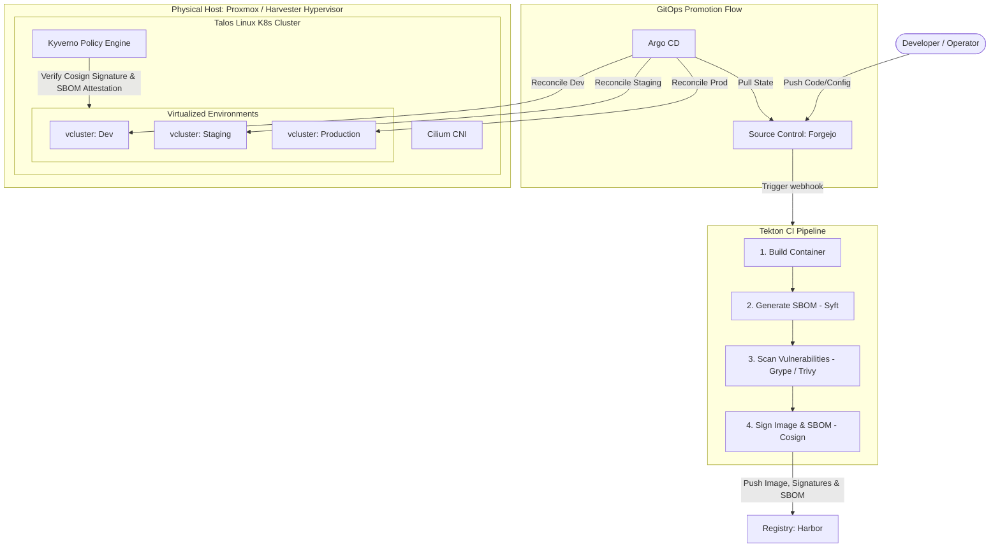
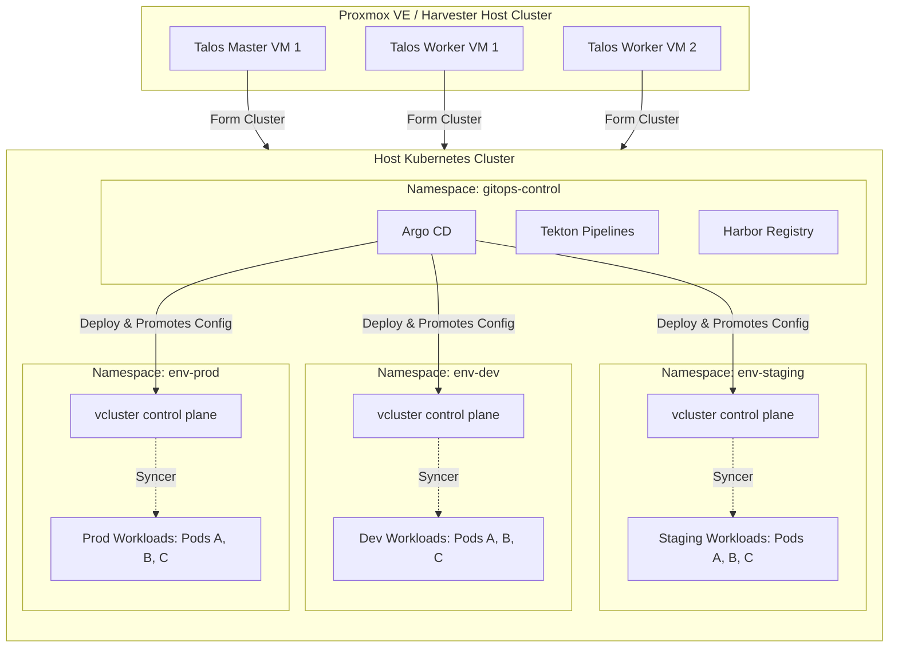

# Enterprise-Grade Kubernetes Homelab Architecture

An enterprise-grade, cloud-native Kubernetes platform for a homelab requires modular, production-ready components that provide high availability, security, and observability. This architecture is designed around the principles of GitOps, zero-trust security, secure software supply chains, and virtualized multi-environment sandboxing.

---

## High-Level Architecture Design

---

## Component Stack Table

Below is the structured list of recommended components for this enterprise-grade, cloud-native Kubernetes homelab.

| Category | Component / Tool | Role in Platform | Why it is Enterprise-Grade | Homelab Alternative / Tip |
| :--- | :--- | :--- | :--- | :--- |
| **Bare-Metal Hypervisor** | **Proxmox VE** or **Harvester** | Virtualization Layer | Type-1 hypervisors that partition physical server hardware. Harvester is built on Kubernetes (using KubeVirt) for a unified cloud-native experience. | Allows running cluster nodes as VMs for easy snapshots, backups, and recovery. |
| **Kubernetes OS** | **Talos Linux** | Immutable K8s Operating System | Immutable, minimal, and secure Linux distro designed specifically for K8s. It has no SSH, no shell, and is configured solely via a YAML API. | Deployed as VMs on your hypervisor. Dramatically reduces the OS attack surface. |
| **Virtual Clusters** | **vcluster** | Environment Sandboxing | Creates virtual Kubernetes clusters inside namespaces on the host Talos cluster. Sandboxes control planes (API, etc.) for isolation. | Run separate virtual clusters for `dev`, `staging`, and `prod` on a single physical host without VM overhead. |
| **Network & CNI** | **Cilium** | Container Network Interface (CNI) | Uses eBPF instead of iptables. Offers high-performance routing, built-in network security policies, and L7 observability. | Cilium provides deep visibility via Hubble and supports Gateway API out of the box. |
| **Storage Engine (CSI)** | **Longhorn** or **Rook-Ceph** | Distributed Persistent Storage | Rook-Ceph orchestrates enterprise Ceph storage for highly-available block (RWO) and file (RWX) storage. Longhorn is a lightweight CNCF storage engine. | Highly suited for stateful services like database files (Keycloak/LDAP) and shared registries (Harbor). |
| **GitOps Engine** | **Argo CD** | Continuous Deployment & Reconciliation | Declarative, Git-driven application lifecycle management. Features multi-tenancy and a web UI dashboard. | Manages environment promotion via Kustomize overlays or Helm values in Git. |
| **Continuous Integration (CI)** | **Tekton** | Kubernetes-native CI Engine | Runs pipelines as K8s-native CRDs (Tasks, Pipelines, PipelineRuns). Scales pods dynamically and is vendor-agnostic. | Seamlessly integrates with Kubernetes IAM and namespaces to execute build/test/scan tasks. |
| **Container Registry** | **Harbor** | Secure Artifact Registry | Enterprise-grade registry supporting RBAC, replication, image signing verification, and Helm chart repositories. | Integrates with Trivy for immediate registry-side vulnerability scanning. |
| **Software Supply Chain** | **Syft** + **Grype** + **Cosign** | SBOM Generation, Scanning & Signing | **Syft** generates SBOMs (Software Bill of Materials); **Grype** scans them; **Cosign** signs the image and attaches the SBOM. | Automates security checks in the Tekton pipeline before images are pushed to Harbor. |
| **Security Policy Enforcement** | **Kyverno** | Kubernetes Policy Engine | Native YAML policies (no Rego). Validates, mutates, and generates K8s configurations to enforce best practices. | Validates Cosign signatures and verifies that a valid SBOM is attached to every deployed image. |
| **Identity & Access (IAM)** | **Keycloak** | Centralized Identity Provider (IdP) | Supports OIDC, SAML 2.0, user federation (LDAP/AD), social login, and fine-grained authorization policies. | Deploy via the **Keycloak Operator**. Connects easily to OpenLDAP or Authentik. |
| **Directory Service** | **OpenLDAP** | User/Group/Department directory | Standard enterprise directory protocol. Simulates enterprise Active Directory (AD) structures. | Run a lightweight OpenLDAP container seeded with users and groups to test Keycloak user synchronization. |
| **Edge Gateway / Ingress** | **Envoy Gateway** (Gateway API) | Edge routing, TLS termination, Auth | Standardized Kubernetes Gateway API implementation. Envoy handles rate limiting, OIDC authentication, and JWT validation at the edge. | Replaces legacy `Ingress` controllers with a unified, role-oriented routing API. |
| **Secrets Management** | **External Secrets Operator (ESO)** | Secret retrieval & syncing | Integrates K8s with external providers (OpenBao, AWS Secrets Manager, 1Password, or SOPS). Prevents plaintext secrets in Git. | Sync secrets from a private vault (like OpenBao) or decrypt files in Git repository using SOPS + Age. |
| **Secrets Vault** | **OpenBao** (OpenSSF) | Secrets Storage & Encryption | An open-source, identity-based secrets and encryption management system under the OpenSSF (fork of HashiCorp Vault). | Stores secrets securely, providing dynamic credential generation and detailed audit trails. |
| **Source Control** | **Forgejo** | Git repository hosting | Fully open-source, community-governed software forge (fork of Gitea). Extremely lightweight and resource-efficient. | Ideal for homelabs due to its minimal resource footprint compared to GitLab. |
| **Observability Stack** | **Prometheus & Grafana** | Metrics monitoring & dashboards | Industry standard for collecting, storing, and visualizing time-series performance data. | Installs via `kube-prometheus-stack` Helm chart. Includes pre-configured dashboards for cluster health. |
| **Log Management** | **Grafana Loki** | Log aggregation | High-efficiency log aggregation system optimized for Kubernetes metadata. | Uses Grafana for unified visualization alongside Prometheus metrics. |

---

## Architectural Deep Dive

### 1. Environment Sandboxing & Promotion Flow (vcluster + GitOps)
To achieve true environment isolation without the overhead of building independent hardware clusters:
- **vcluster Isolation:** The main Talos cluster acts as the "host." Inside it, namespaces like `env-dev`, `env-staging`, and `env-prod` are created. A `vcluster` is deployed inside each namespace.
  - Developers get `admin` context to their specific `vcluster`. 
  - The vcluster control plane (API server, SQLite/k3s datastore) runs isolated, while actual workloads are synced down and run on the host Talos cluster nodes.
- **GitOps Promotion:**
  - **Git Repo Structure:** A monorepo containing directories for configurations: `deploy/base`, `deploy/overlays/dev`, `deploy/overlays/staging`, and `deploy/overlays/prod`.
  - **Argo CD Multi-Source:** Argo CD has target destinations pointing to the kubeconfig/API endpoint of each respective `vcluster`.
  - **Promotion Process:** To promote a version, a Pull Request is merged from `dev` to `staging`, and then to `main` (prod). Argo CD reconciles the changes, deploying the new container tags to the target virtual cluster.

### 2. Secure Software Supply Chain (Tekton + Syft + Grype + Cosign + Kyverno)
An enterprise supply chain guarantees that only verified, scan-compliant containers can execute.
1. **CI Execution (Tekton):** A pipeline is triggered in Tekton upon a git push to Forgejo.
2. **Build and SBOM (Syft):** The image is compiled, and `Syft` scans the file system to produce a CycloneDX/SPDX SBOM file.
3. **Vulnerability Scan (Grype & Trivy):** `Grype` scans the generated SBOM. If vulnerabilities exceeding the threshold (e.g., High/Critical) are found, the pipeline fails.
4. **Signing and Attestation (Cosign):**
   - The build process generates a public/private keypair (or uses keyless signing via Fulcio/Rekor).
   - `Cosign` signs the container image.
   - `Cosign` attaches the scanned SBOM as an **attestation** to the signed image in Harbor.
5. **Enforcement (Kyverno):**
   - A Kyverno `ClusterPolicy` is deployed on the host Talos cluster.
   - When a pod creation request is made in any namespace (or vcluster), Kyverno intercepts it.
   - It verifies that the image signature matches the trusted Cosign public key.
   - It validates that a signed SBOM attestation exists in Harbor.
   - If any verification fails, the pod deployment is blocked.

### 3. Hypervisor & Immutable OS (Proxmox/Harvester + Talos Linux)
- **Hypervisor:** Bare-metal hosts run **Proxmox VE** or **Harvester** to partition compute, memory, and storage.
- **Immutable Nodes:** Talos Linux runs inside these virtual machines. Because Talos is read-only, has no SSH, and does not permit ad-hoc commands, the Kubernetes control plane is secure by default. Node upgrades are performed entirely declaratively by updating the machine configuration file.

### 4. Cloud-Native Storage Architecture (Rook-Ceph / Longhorn)
Stateful applications in Kubernetes (like databases, registry storage, and git data) require persistent volume provisioning that is dynamic, reliable, and integrated with the cluster lifecycle:
- **Dynamic Provisioning via CSI:** When a pod requests storage via a `PersistentVolumeClaim` (PVC), the Container Storage Interface (CSI) driver dynamically creates a `PersistentVolume` (PV) on the storage pool and attaches it to the node.
- **Access Modes & Use Cases:**
  - **ReadWriteOnce (RWO) - Block Storage:** Ideal for databases (Keycloak PostgreSQL, OpenLDAP). Utilizes Ceph RBD (Rook-Ceph) or Longhorn block devices for high-performance IOPS and data integrity.
  - **ReadWriteMany (RWX) - Shared Filesystem:** Required for multi-pod read/write workloads (Harbor registry storage, Forgejo repository sharing). Utilizes CephFS or a shared NFS path.
- **Data Protection:** Configured with CSI Volume Snapshots and automated backup policies synced to a secondary external destination (e.g., a local NAS via TrueNAS / MinIO S3 bucket).

---

## Hardware Requirements & Sizing

Running a Kubernetes cluster with a secure supply chain (Harbor, Tekton), IAM (Keycloak), GitOps (Argo CD), and three separate environments (vcluster instances) requires a solid hardware profile, primarily due to the memory footprint of the management tools.

### 1. Hardware Footprint Breakdown
We categorize resource usage into two main layers:
- **Management Plane (Control Plane Host)**: Forgejo, Harbor, Tekton, Argo CD, Keycloak, Prometheus, Grafana, Loki, Kyverno, and Cilium. These are memory-intensive.
- **Tenant Plane (Virtualized Environments)**: `vcluster` control planes (very light, ~200MB RAM each) + actual application workloads (Dev, Staging, Prod).

### 2. Resource Estimations
| Component Layer | CPU Cores | RAM | Storage Type | Storage Size |
| :--- | :--- | :--- | :--- | :--- |
| **Management Plane** | 6 Cores | 16 GB | NVMe SSD (High IOPS) | 150 GB (Registry + logs) |
| **Dev Environment** | 2 Cores | 4 GB | SSD | 50 GB |
| **Staging Environment** | 2 Cores | 4 GB | SSD | 50 GB |
| **Prod Environment** | 4 Cores | 8 GB | SSD | 50 GB |
| **Hypervisor Overhead** | 2 Cores | 4 GB | - | - |
| **Total Requirements** | **16 Cores** | **36 GB** | **NVMe/SSD** | **300 GB+** |

### 3. Recommended Hardware Configurations

#### Option A: The "All-in-One" Mini PC (Budget & Silent)
A single modern Mini PC (Intel NUC, Minisforum, or Beelink) is the easiest way to start.
- **CPU**: AMD Ryzen 7/9 (8 Cores, 16 Threads) or Intel Core i7/i9.
- **RAM**: 64 GB DDR4/DDR5 (crucial to allow room for growth).
- **Storage**: 1TB or 2TB NVMe PCIe Gen4 SSD.
- **Network**: 1x 2.5 GbE port.

#### Option B: The "High Availability" Mini PC Cluster (Enterprise-Like)
To simulate enterprise node failures and practice host-level maintenance (Talos upgrades, hypervisor clustering):
- **Nodes**: 3x Mini PCs (e.g., Lenovo ThinkCentre Tiny M920q, HP ProDesk 600 G4, or Beelink EQ12).
- **Specs per Node**: 4-6 Cores, 16-32 GB RAM, 512GB NVMe SSD.
- **Distributed Storage**: Ceph (built into Proxmox) or Longhorn (installed in Talos) to replicate storage across all 3 nodes. If one node dies, virtual environments remain online.

---

## Multi-Environment Deployment Topology

How do these 3 environments look in practice? They are mapped to three virtual clusters hosted inside a single Talos Linux host cluster.

### How the Environments Differ & Operate:

1. **Virtual Cluster Isolation (`vcluster`)**
   - Each environment has its own virtual API server, CoreDNS, and state. 
   - A developer accessing `dev` gets a `kubeconfig` pointing to the `dev` vcluster and can create namespaces, service accounts, and CRDs without affecting `staging` or `prod` or the host cluster.
   - The **Syncer** agent inside each vcluster copies actual Pod resources down to the host namespace (e.g., `env-dev`), where the host cluster scheduler (Talos nodes) runs them.

2. **Ingress and Routing**
   - The host cluster runs Envoy Gateway (Gateway API).
   - We define separate domain names or paths for each environment:
     - `dev.homelab.local` -> routes via HTTPRoute to the services in `vcluster-dev`.
     - `staging.homelab.local` -> routes to `vcluster-staging`.
     - `prod.homelab.local` -> routes to `vcluster-prod`.

3. **Promotion Flow in Practice**
   - **Dev**: Automatically builds on Git commits to the `dev` branch. Tekton compiles the code, signs the image with Cosign, runs vulnerability checks, and pushes to Harbor. Argo CD instantly deploys to the `dev` vcluster.
   - **Staging**: Merging `dev` into `staging` triggers a Tekton run (or reuse of the signed image tag). Argo CD updates the `staging` vcluster. Staging is used for integration testing.
   - **Production**: Promotion is triggered by creating a Release Tag or merging into the `main` branch. Argo CD deploys the tag to the `prod` vcluster.

---

## Running PostgreSQL Clusters (CloudNativePG / pgcluster)

This enterprise-grade homelab setup is highly optimized to host highly available PostgreSQL database clusters using Kubernetes-native operators like **CloudNativePG (CNPG)**.

### 1. Integration with the Storage Engine
PostgreSQL relies on persistent, low-latency disk writes. 
- **Storage Class Binding**: Each PostgreSQL replica pod gets its own dedicated `PersistentVolumeClaim` (PVC) requesting `ReadWriteOnce` (RWO) storage.
- **Rook-Ceph (Ceph RBD) / Longhorn**: Under the hood, the storage engine provisions local or distributed block volumes directly. Ceph's eBPF-optimized path (via Cilium) provides low latency, making it ideal for transaction write-ahead logs (WAL) and raw tables.
- **Shared-Nothing Replication**: Operators like CloudNativePG use standard streaming replication (primary-standby). Rather than sharing a single volume, each database node runs on its own distinct PV, preventing a single point of failure (SPOF) at the database storage layer.

### 2. Networking & High Availability (CNPG + Cilium)
- **Fast Failovers**: Cilium eBPF CNI handles direct service routing and network policies. In the event of a primary Postgres node failure, the operator detects it in seconds, promotes a standby replica to primary, and updates the K8s service endpoints. Cilium handles this re-routing with sub-millisecond connection updates.
- **Secure Traffic**: Network Policies enforce that only designated application services (e.g., Keycloak or your demo apps) can connect to the database ports, blocking arbitrary traffic.

### 3. Execution inside virtual clusters (vcluster)
You can run the PostgreSQL cluster inside `vcluster` instances (e.g., a dev database inside `vcluster-dev`, and a production database inside `vcluster-prod`):
- **Virtual CRDs**: The CloudNativePG operator runs inside the vcluster, allowing developers to define `Cluster` custom resources in the sandbox.
- **Resource Syncing**: The `vcluster` syncer transparently copies the resulting Postgres Pods and PVCs to the host cluster namespace (e.g., `env-prod`). The host storage engine (Longhorn/Rook-Ceph) creates the actual PVs on the host. 
- **Logical Isolation**: This gives you full logical database control in each sandbox (enabling independent backups, version upgrades, and parameter tuning) while utilizing the shared physical host hardware.

### 4. Continuous Backups (S3 Integration)
Postgres operators archive WAL files and database snapshots to an S3-compatible object store. In this architecture, **Harbor's S3 storage backend** (or a local **MinIO** instance running on the host cluster) acts as the target storage, enabling instant recoveries (Point-in-Time Recovery - PITR) directly from the GitOps configuration.

---

## Cluster Backup & Disaster Recovery (DR) Strategy

This setup is fully compatible with, and designed for, robust backup and disaster recovery (DR) protocols across multiple layers of the stack.

### 1. The Declarative Layer (GitOps Rebuild)
Because the entire platform configuration (Namespaces, Policies, Gateway API routing, Argo CD applications, and `vcluster` setups) is managed declaratively in **Forgejo**:
- **Recovery Time Objective (RTO) for Config**: **Minutes**.
- **Process**: In the event of a total cluster loss (hardware fire, fatal OS corruption), you simply provision a fresh Talos cluster, deploy Argo CD, and point it back to your Forgejo git repository. Argo CD will instantly reconcile the entire cluster structure back to its desired state.

### 2. The VM & Node Layer (Hypervisor-Level Backup)
If running on **Proxmox VE** or **Harvester**:
- **Proxmox Backup Server (PBS)** or native Harvester backups can be scheduled to capture VM snapshots of your Talos control-plane and worker nodes daily.
- **Deduplicated & Encrypted**: Restoring a failed worker or control-plane node takes seconds, returning the VM to its exact state prior to the failure.

### 3. The Stateful Data Layer (Persistent Volumes)
For databases, registry files, and Git repositories that cannot be reconstructed from Git configurations alone, you can implement **Velero** alongside your storage engine:
- **Velero (CNCF)**: Installed on the host cluster. Velero integrates with the `VolumeSnapshot` CRDs of Rook-Ceph or Longhorn.
  - **S3 Backup Target**: Velero backs up K8s API resources and triggers CSI snapshots of PVs, uploading them to an off-site S3 storage bucket (e.g., TrueNAS MinIO, AWS S3, or Backblaze B2).
- **Longhorn Native Backups**: Longhorn can directly target an NFS share or S3 bucket, scheduling incremental backups of individual PVs. If a volume is deleted or corrupted, it can be restored directly from the Longhorn UI/API.

### 4. Database-Specific Backups (PITR)
For Postgres clusters running via **CloudNativePG**:
- CNPG does not rely on block snapshots for hot backups. Instead, it streams Write-Ahead Logs (WAL) in real-time to an S3-compatible storage bucket.
- **Disaster Recovery**: Allows you to restore a database to a specific second in the past (Point-in-Time Recovery), mitigating database corruption or accidental user deletion without losing hours of transactions.

### 5. Virtual Cluster (`vcluster`) Backups
Because a `vcluster` runs inside a namespace on the host Talos cluster:
- Backing up the host namespace containing the vcluster (using Velero) captures the virtual etcd/SQLite state file and configuration.
- Upon restoration of the namespace, the virtual cluster control plane re-spawns and automatically attaches to its corresponding persistent storage.

---

## Homelab Hardware Expansion & Re-use Plan

To deploy this enterprise-grade Kubernetes platform with 3 virtual environments (vcluster) and a full management plane (Forgejo, Harbor, Tekton, Keycloak, etc.), you can expand your resources by combining your upgraded existing HP EliteDesk with a new, higher-performance host.

### 1. Re-using Your Existing Server (HP EliteDesk 800 G3 DM)
Your HP EliteDesk 800 G3 DM is a solid, power-efficient, ultra-small form factor (USFF) PC.
- **CPU**: Intel Core i5-6500T (4 Cores / 4 Threads, 35W TDP).
- **RAM Upgrade**: Installing the **PNY 16GB (2x8GB) SODIMM kit** (running at DDR4-2400 limits due to CPU) will upgrade the machine to **16GB total RAM**.
- **Storage Upgrade**: Installing the **KingSpec 512GB 2.5" SATA SSD** provides plenty of read/write capacity for this node.
- **M.2 Slot Access**: Note that the HP 800 G3 DM contains both a 2.5" SATA bay *and* an M.2 NVMe slot. You can keep the original 128GB SSD in the M.2 slot for the OS (Proxmox/Talos boot) and use the new 512GB SATA SSD exclusively for VMs/workloads.

### 2. Strategy A: The "Two-Node Hybrid Cluster" (Unified Proxmox Pool)
You can buy a second, high-performance Mini PC and link it with the HP EliteDesk inside a single Proxmox VE datacenter:
- **New Node (Primary)**: Run a beefy host with **64GB RAM** and **1TB/2TB NVMe SSD** (e.g., AMD Ryzen 7/9 or Intel Core i7 12th/13th Gen).
- **HP Node (Secondary)**: Run your upgraded HP EliteDesk (16GB RAM / 512GB SSD).
- **Workload Allocation**:
  - **New Node (Host for Heavy Services)**: Hosts control-plane VMs, Harbor, Tekton CI, and the `env-prod` vcluster.
  - **HP Node (Host for Light Services)**: Hosts the `env-dev` and `env-staging` vclusters, Keycloak, and OpenLDAP, which do not need massive CPU resources.
  - **Storage Sync**: Use Proxmox replication to copy VMs between nodes, or use **Longhorn** inside Kubernetes to replicate block storage across both nodes for failover support.

### 3. Strategy B: Dedicated Utility Node (Infrastructure Support)
Instead of putting the HP EliteDesk inside the Kubernetes cluster, use it as a dedicated utility node running outside Kubernetes:
- **Free up K8s Resources**: Run support systems directly on the HP EliteDesk to save memory and CPU on your new main server:
  - **Forgejo** (Git Server)
  - **OpenBao** (Secrets Manager)
  - **Proxmox Backup Server (PBS)** (Backing up all K8s master/worker VMs from your main host to the HP's 512GB SSD)
  - **Router / DNS / VPN Server** (OPNsense, Pi-hole, AdGuard, Wireguard)
- **New Server**: Dedicated 100% to your Talos K8s cluster (Control Plane VM + Worker VMs).

### 4. New Hardware Purchasing Guide

To pair with your existing HP EliteDesk, look for one of the following high-density mini PCs:

| Option | Specs & CPU | Recommended RAM | Storage Slots | Est. Cost (USD) |
| :--- | :--- | :--- | :--- | :--- |
| **Beelink SER5 MAX / SER6** | AMD Ryzen 7 5800H / 7735HS (8 Cores, 16 Threads) | 32GB or 64GB DDR4/DDR5 | 2x M.2 NVMe | \$300 - \$450 |
| **Minisforum MS-01** | Intel Core i9-12900H / i5-12600H (Enterprise Mini Workstation) | Supports up to 64GB / 96GB | 3x M.2 NVMe, 10GbE network ports | \$500 - \$750 |
| **Used Lenovo/HP/Dell Tiny** (Gen 6/7/8) | Intel Core i5/i7 (10th/11th Gen - e.g., Dell Optiplex 7080 Tiny) | Upgradable to 64GB DDR4 | 1x M.2 NVMe, 1x SATA | \$200 - \$350 (Used) |

*Recommendation:* A **Beelink SER5 MAX** (AMD Ryzen 7 5800H, 8 Cores / 16 Threads) configured with **64GB RAM** provides the highest performance-to-cost ratio for running the management plane (Harbor, Tekton) and the virtual environments.

### 5. Clustered Setup Considerations: Quorum, HA, and Node Affinity

You can absolutely integrate the HP EliteDesk directly into a single clustered system alongside your new server. However, designing a heterogeneous multi-node cluster requires addressing two main challenges: **Quorum** and **Workload Scheduling**.

#### A. The Quorum Challenge (Split-Brain Prevention)
Clustered systems (both Proxmox VE and etcd in Kubernetes control planes) require a **strict majority (quorum)** to operate. 
- **The Issue with a 2-Node Cluster**: If you have exactly two physical machines (New Server and HP EliteDesk), and one machine fails or loses network connection, the surviving machine has only 50% of the votes (not a majority). It will freeze automatic failover of VMs and storage.
- **The Solution (Tie-Breaker / QDevice)**:
  - You can add a third, very low-power device to act purely as a voting witness (no workload execution). 
  - For Proxmox, you can configure a **Proxmox QDevice** on a Raspberry Pi, an old laptop, or a cheap mini PC. This third device provides the tie-breaker vote, enabling full automatic failover between your main server and the HP EliteDesk.
  - For Kubernetes control planes, you can run a single Control Plane VM on the new server, and run both physical hosts as Worker nodes, avoiding etcd multi-node quorum issues entirely.

#### B. Workload Placement via Node Affinity
Because the new server will be significantly more powerful than the HP EliteDesk i5-6500T, you must prevent heavy tasks from running on the weaker node.
- **Kubernetes Node Labels**: Label your nodes to distinguish their capability:
  - `kubectl label nodes hpelitedesk performance-tier=low`
  - `kubectl label nodes new-server performance-tier=high`
- **Targeting Workloads**:
  - **Dev/Staging vclusters**: Configure the virtual clusters or individual dev pods with a `nodeSelector` or `nodeAffinity` pointing to `performance-tier=low`. This forces the HP EliteDesk to host your testing sandboxes.
  - **Production vcluster / Tekton CI / Harbor**: Deploy these with `performance-tier=high`, keeping compile jobs and production workloads on the Ryzen/Intel Core i7 node.
- **Failover Tolerations**: In the event of a new server failure, you can allow the HP EliteDesk to temporarily host staging/prod workloads (with reduced performance) until the primary server is recovered.

---

## Repurposing Your HP EliteDesk 800 G3 DM

If you purchase a high-capacity main server like the **Beelink SER5 MAX (64GB RAM)** or the **Minisforum MS-01 (64GB-96GB RAM)**, that single host will have enough resources to run the entire Kubernetes platform virtualized. In this scenario, your upgraded HP EliteDesk (i5-6500T, 16GB RAM, 512GB SSD) can be repurposed to dramatically increase the reliability, speed, and safety of your homelab.

### Option 1: Inside the Cluster (Dedicated Worker Node)
You can include the HP EliteDesk directly in your Kubernetes cluster as a worker node, leveraging the resource allocation strategies:
- **Sandbox Workload Offloading**: Use Node Affinity to pin your **Dev (`vcluster-dev`)** and **Staging (`vcluster-staging`)** environments to the HP EliteDesk. This ensures that development spikes (like running large test suites or debugging database operators) run entirely on the HP Mini, keeping the Beelink/Minisforum 100% dedicated to stable production workloads.
- **Dynamic PV Replication (Longhorn / Rook-Ceph)**: Use the HP's 512GB SSD to store volume replicas. Longhorn will automatically replicate data across the new server and the HP EliteDesk. If the new server's NVMe drive fails, your services can instantly failover and mount the replica data hosted on the HP.

### Option 2: Outside the Cluster (Dedicated Infrastructure & Backups)
Running critical core services outside Kubernetes prevents "chicken-and-egg" situations during cluster upgrades, maintenance, or outages.

#### A. Dedicated Backup Server (Proxmox Backup Server - PBS)
- **What it does**: Install **PBS** bare-metal on the HP EliteDesk.
- **Why it is great**: It will automatically back up all virtual machines (K8s control-planes, databases, and worker nodes) running on your primary Beelink/Minisforum host. PBS supports deduplication, incremental backups, and encryption. Since backups are stored on a separate physical machine (the HP's 512GB SSD), you are completely protected against main host hardware failure.

#### B. Independent Code & Secrets Vault (Forgejo & OpenBao)
- **What it does**: Deploy your Git Repository (**Forgejo**) and Secrets Manager (**OpenBao**) directly on the HP EliteDesk (as native services or lightweight Docker containers, outside the main K8s cluster).
- **Why it is great**: If your main Kubernetes cluster goes completely down or you need to wipe/re-install Talos Linux from scratch, your code (Forgejo) and secrets (OpenBao) remain 100% online and accessible on the HP. You can reconstruct the entire Kubernetes cluster from the Git files stored on the HP.

#### C. Homelab Router & Network Controller (OPNsense / Pi-hole / WireGuard)
- **What it does**: Turn the HP Mini into a virtualized gateway/firewall.
- **Why it is great**:
  - Run **OPNsense** to handle network routing and isolation for your labs.
  - Run **Pi-hole / AdGuard Home** to provide local DNS resolution for your homelab domains (like `dev.homelab.local` and `prod.homelab.local`).
  - Run **WireGuard VPN** so you can securely SSH into your nodes, access Harbor, or read Argo CD dashboards from anywhere outside your home network.
