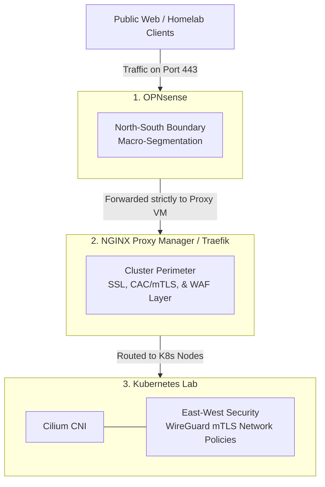

# DoD-Style Homelab Network Exercise

Yes — this entire enterprise-grade, DoD-compliant architecture can be replicated in a homelab using 100% free and open-source tools. Building it is one of the best ways to practice enterprise security engineering, network segmentation, and modern cloud-native defense patterns without buying $10,000 of enterprise hardware.

Below is a mapping of the "DoD-approved" architectural model onto a homelab stack built from VMs or mini-PCs.

---

## The Homelab Architecture Mapping

---

## Step-by-Step Blueprint to Build It

### Step 1: Secure the North-South Edge (The Firewall)

Instead of pfSense with automated plugins, use a hardened firewall to strictly enforce static network isolation.

- **The software**: OPNsense (or pfSense CE).
- **The implementation**: Create isolated VLANs or distinct network bridges in your hypervisor (Proxmox, ESXi, or Hyper-V). Keep your primary Kubernetes nodes on a strictly isolated subnet (e.g., `10.0.40.0/24`) that has no direct access to your home's main Wi-Fi network.
- **The security rule**: Create a strict firewall rule that only allows inbound traffic on port 443 (HTTPS) to hit a single IP address — your reverse proxy. Block everything else.

### Step 2: Build the Cluster Perimeter (The Ingress & WAF)

To practice the "separation of duties" principle, don't let your firewall talk to Kubernetes directly, and don't use automated API controllers. Use a dedicated proxy layer.

- **The software**: NGINX Proxy Manager, Traefik, or Envoy.
- **The implementation**: Spin up this proxy on a standalone VM or a dedicated machine outside your Kubernetes cluster.
- **The security practice**:
  - **WAF layer**: Enable ModSecurity or Coraza (open-source WAFs) on your proxy to screen traffic for SQL injection and XSS before it touches Kubernetes.
  - **mTLS/CAC practice**: Configure NGINX to require a client certificate. In a real DoD environment this checks a user's physical Common Access Card (CAC). In your homelab, generate your own local Certificate Authority (CA), issue a client certificate to your browser, and force NGINX to drop any connection that doesn't present your home-brewed certificate.

### Step 3: Enforce East-West Defense (The Kubernetes Internal Network)

Once traffic enters your cluster, isolate your containers from one another so that if one app is compromised, the attacker cannot pivot to other applications.

- **The software**: Cilium (CNI) and Hubble (for visibility).
- **The implementation**: When setting up your Kubernetes lab (using lightweight options like K3s or Talos Linux), deploy it without a default network provider and install Cilium.
- **The security practice**:
  - **Transparent encryption**: Turn on Cilium's built-in WireGuard transparent encryption, which encrypts all traffic between Kubernetes worker nodes natively in the Linux kernel — matching military-grade data-in-transit rules.
  - **Network policies**: Write `CiliumNetworkPolicy` YAML files. Force a strict default-deny posture where a frontend container (e.g., a web UI) is physically blocked from talking to your database container unless you explicitly write a rule allowing it on a specific port.

---

## Suggested Homelab Infrastructure Options

To run all of this efficiently at home, you don't need beefy enterprise gear:

| Hardware Type | Ideal Role | Software Configuration |
|---|---|---|
| Intel N100 mini PC (with dual Intel NICs) | Dedicated edge firewall | Install OPNsense bare-metal. |
| Refurbished tiny/mini/micro PC (Intel Core i5, 16–32GB RAM) | Single-node hypervisor | Install Proxmox VE. Run your reverse proxy VM and a multi-node virtualized K3s cluster together. |
| 3x cheap mini PCs or Raspberry Pi 5s (8GB) | Physical K8s cluster | Build a bare-metal K3s/Talos cluster linked to your OPNsense router via a cheap managed network switch. |

---

## Open Questions to Scope the Build

- What hardware or hypervisor (e.g., Proxmox, VirtualBox, or physical machines) is available right now?
- Deploy a virtualized cluster inside one machine, or link physical node hardware together?

Once scoped, the next step is exact configuration commands and YAML templates to get the network and cluster talking securely.

---

## References

- [How to Secure Your Homelab Network from the Ground Up](https://medium.com/@sync-with-ivan/how-to-secure-your-homelab-network-from-the-ground-up-ebb64df82e94)
- [r/homelab: First Day Home Labbing](https://www.reddit.com/r/homelab/comments/1g37syp/first_day_home_labbing_what_i_learned_3_hours/)
- [Setup Homelab to Practice Penetration Testing](https://www.blpc.com/2025/02/17/setup-homelab-to-practice-penetration-testing/)
- [Making My Homelab Services Available with NGINX Proxy Manager](https://medium.com/@neocities_1123/making-my-homelab-services-available-to-me-anywhere-in-the-world-with-nginx-proxy-manager-13f04b7835d7)
- [Create a Certificate Authority for Your Homelab](https://support.tools/create-certificate-authority-homelab/)
- [r/kubernetes: Talos Linux and GitOps](https://www.reddit.com/r/kubernetes/comments/12994mx/unleashing_the_power_of_talos_linux_and_gitops_my/)
- [r/minilab: Mini PC Specs](https://www.reddit.com/r/minilab/comments/1p20r0a/generally_whats_specs_do_you_look_for_in_a_mini/)
